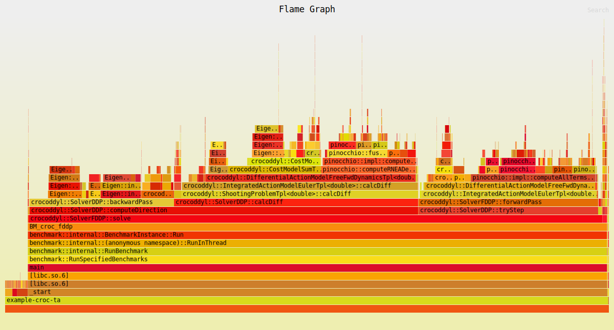
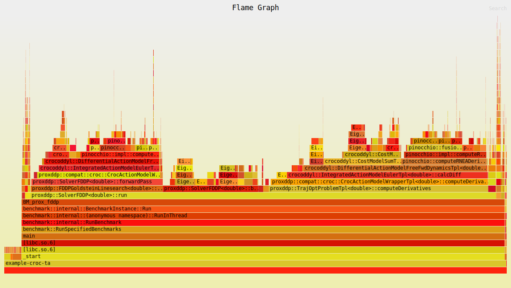

# Developer's guide

When creating the CMake build, make sure to add the `-DCMAKE_EXPORT_COMPILE_COMMANDS=1` flag. See its documentation [here](https://cmake.org/cmake/help/latest/variable/CMAKE_EXPORT_COMPILE_COMMANDS.html).

A template project for using **aligator** with CMake and C++ can be found in the [aligator-cmake-example-project](https://github.com/Simple-Robotics/aligator-cmake-example-project) repository.

## Creating a Python extension module

When **aligator** is installed, the CMake configuration file (`aligatorConfig.cmake`) provides a CMake function to help users easily create a [Python extension module](https://docs.python.org/3/extending/extending.html).
Users can write an extension module in C++ for performance reasons when providing e.g. custom constraints, cost functions, dynamics, and so on.

The CMake function is called as follows:
```cmake
aligator_create_python_extension(<name> [WITH_SOABI] <sources...>)
```

This will create a CMake `MODULE` target named `<name>` on which the user can set properties and add an `install` directive.

An usage example can be found in [this repo](https://github.com/Simple-Robotics/aligator-cmake-example-project).

## Debugging

### Debugging a C++ executable

This project builds some C++ examples and tests. Debugging them is fairly straightforward using GDB:

```bash
gdb path/to/executable
```

with the appropriate command line arguments. Examples will appear in the binaries of `build/examples`. Make sure to look at GDB's documentation.

If you want to catch `std::exception` instances thrown, enter the following command once in GDB:

```gdb
(gdb) catch throw std::exception
```

### Debugging a Python example or test

In order for debug symbols to be loaded and important variables not being optimized out, you will want to compile in `DEBUG` mode.

Then, you can run the module under `gdb` using

```bash
gdb --args python example/file.py
```

If you want to look at Eigen types such as vectors and matrices, you should look into the [`eigengdb`](https://github.com/dmillard/eigengdb) plugin for GDB.

### Hybrid debugging with Visual Studio Code

**TODO** Finish documenting this

## Profiling

We use [google benchmark](https://github.com/google/benchmark/tree/v1.5.0) to define C++ benchmarks
which are able to aggregate data from runs, and [Flame Graphs](https://github.com/brendangregg/FlameGraph) to produce a breakdown of the various function calls and their importance as a proportion of the call stack.

If you have the Rust toolchain and `cargo` installed, we suggest you install [cargo-flamegraph](https://github.com/flamegraph-rs/flamegraph). Then, you can create a flame graph with the following command:

```bash
flamegraph -o my_flamegraph.svg -- ./build/examples/example-croc-talos-arm
```


Here's Crocoddyl's flame graph:

Here's for `aligator::SolverFDDP`:

